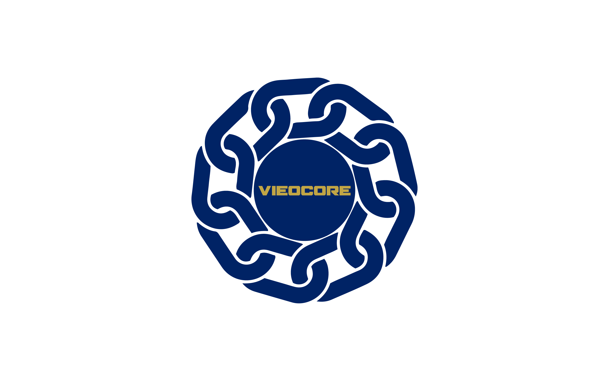

 

 
 

    <a href="https://jitblu.com">Home Page</a> |
    <a href="https://discord.gg/refine">Discord</a> |
    <a href="https://jitblu.com/examples/">Examples</a> | 
    <a href="https://jitblu.com/blog/">Blog</a> | 
    <a href="https://jitblu.com/docs/">Documentation</a> | 
    <a href="https://github.com/refinedev/refine/projects/1">Roadmap</a>

 

<strong>VieoCore is a comprehensive project aimed at facilitating research, education, and implementation processes for JitBlu, Inc, its subsidiaries and stakeholders involved in the planning, development, and deployment of VIEO Network blockchain, products, services, and technological advancements. This project serves as a centralized platform for all activities related to VIEO Network, ensuring seamless coordination and collaboration between stakeholders.   With its innovative approach, VieoCore promises to enhance the efficiency and effectiveness of VIEO Network's operations, ultimately contributing to the success of the company and its stakeholders.

 
 

## Table of Contents
- [Table of Contents](#table-of-contents)
- [What is vieocore?](#what-is-vieocore)
- [Key Features](#key-features)
- [Quick Start](#quick-start)
- [Roadmap](#roadmap)
- [Contribution](#contribution)
- [Our ♥️ Contributors](#our-️-contributors)
- [License](#license)

## What is vieocore?

## Key Features

## Quick Start

## Roadmap

## Contribution

## Our ♥️ Contributors

## License